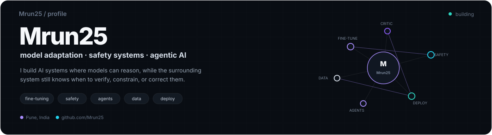
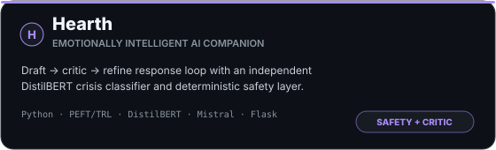
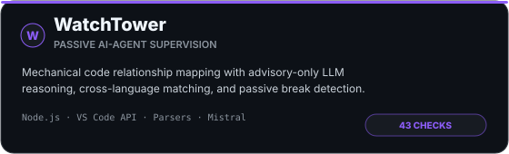
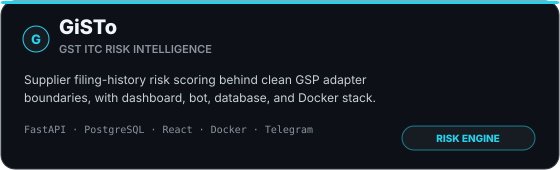

  

  
  
  

I like building AI systems where the model gets to reason, but the surrounding system still knows when to verify, constrain, or correct it.
Most of my work sits around fine-tuning, NLP safety, agentic workflows, retrieval, and production ML systems — the part where a model stops being an isolated experiment and becomes something that has to handle data, failure modes, APIs, deployment, and real users.
What I build
- Model adaptation & fine-tuning — LoRA/PEFT, TRL, quantization, data normalization, train/validation pipelines, and model evaluation.
- NLP safety & model supervision — crisis classification, deterministic pre-filters, critic/refine loops, and systems where an LLM is not allowed to be the only safety boundary.
- Agentic systems — retrieval, memory, self-correction, multi-provider orchestration, and tool-driven workflows.
- Production ML products — APIs, databases, Docker, AWS, schedulers, OAuth, automated tests, and CI/CD around ML systems.
Flagship work

  
  

  
  

The engineering behind them
- Hearth explores model behavior and safety as an engineering problem: a draft → critic → refine loop, an independent DistilBERT crisis classifier, a deterministic keyword safety layer, and a configurable fine-tuning pipeline using LoRA/PEFT, TRL, and quantization.
- WatchTower supervises AI coding agents without letting the LLM become the source of truth. The codebase relationship map is built mechanically, while Mistral is used only as an advisory reasoning layer for prompt refinement, explanation, and context-aware chat.
- GiSTo is a GST ITC risk-intelligence platform built around clean system boundaries: FastAPI + PostgreSQL/Alembic, a React CA dashboard, supplier filing-history risk scoring, a swappable GSP adapter, Telegram integration, and Docker Compose.
- Niche Inbox is an end-to-end automation pipeline: NewsAPI ingestion → Mistral summarization → per-recipient APScheduler jobs → Gmail OAuth2 delivery, deployed for continuous operation on AWS EC2.
Selected collaborative work
- MNEME — sovereign memory infrastructure for AI agents. I worked on the frontend & compliance UI, GDPR flows, Memory Market, and protocol/infrastructure pieces. The project won Monad Blitz Pune V2.
- fumii — physical AI companion with local memory and provenance intelligence. My work focused on AI/LLM integration, prompt engineering, personality/emotion behavior, and desktop/emotion logic.
- Lumi — accessibility-focused voice guidance system. I worked on the voice & inference pipeline, including ASR/TTS, language detection, and interaction flow.
- EPFO Validator — hackathon prototype developed jointly with Hassan Rehman, focused on validation workflows and product execution.
Applied ML & data work
- Fraud & Anomaly Detection — deterministic fraud rules + Isolation Forest + XGBoost + SHAP explainability, composite risk scoring, and Power BI/HTML dashboards.
- Customer Churn Analysis using R — logistic regression, churn segmentation, and business-oriented interpretation.
- Marketing Funnel & A/B Testing — funnel analysis, statistical experimentation, SQL views, and Power BI reporting.
- Agentic Study Planner — memory-driven multi-agent planning with adaptive replanning and Google Calendar synchronization.
Selected recognition
<table align="center">
  <tr>
    <td align="center" width="185">
      <b>Monad Blitz Pune V2</b> 
      MNEME 
      <b>WINNER</b>
    </td>
    <td align="center" width="185">
      <b>iQOO Pune City Battle</b> 
      Lumi 
      <b>TOP 22 FINALIST</b>
    </td>
    <td align="center" width="185">
      <b>I-HACK · IIT Bombay</b> 
      2025 
      <b>SELECTED / FINALIST</b>
    </td>
  </tr>
  <tr>
    <td align="center" width="185">
      <b>IEEE Tech for Good</b> 
      2026 
      <b>HACKATHON</b>
    </td>
    <td align="center" width="185">
      <b>Google Solution Challenge</b> 
      2025 
      <b>PARTICIPANT</b>
    </td>
    <td align="center" width="185">
      <b>Bluestock Fintech</b> 
      Feb 2026 – Apr 2026 
      <b>SDE INTERN</b>
    </td>
  </tr>
</table>

The stack I reach for

  

  <code>LoRA / PEFT</code> ·
  <code>TRL</code> ·
  <code>BitsAndBytes</code> ·
  <code>DistilBERT</code> ·
  <code>Hugging Face</code> ·
  <code>RAG</code> ·
  <code>agentic self-correction</code> ·
  <code>Mistral</code> ·
  <code>scikit-learn</code> ·
  <code>SHAP</code> ·
  <code>OAuth2</code> ·
  <code>CI/CD</code>

Experience & education
<table>
  <tr>
    <td width="50%">
      <b>Bluestock Fintech</b> 
      SDE Intern · Feb 2026 – Apr 2026 · Remote  
      Worked on a production-ready corporate blog platform spanning authentication, CMS, SEO/SSG/ISR, database design, and CI/CD.
    </td>
    <td width="50%">
      <b>B.E. Artificial Intelligence</b> 
      Zeal College of Engineering & Research · SPPU  
      CGPA: <b>9.71 / 10</b>
    </td>
  </tr>
</table>

<b>Certifications & programs</b>

 

- Google Responsible AI Certification
- Google Gen AI Study Jam
- Microsoft Data Analytics 101
- Deloitte Virtual Internship Program (2025)

Visitor counter

  

