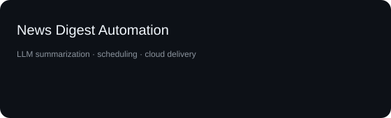

  

  
  

I build AI systems around **model adaptation, evaluation, agentic workflows, and production deployment**.

## What I build

- **Model adaptation** — LoRA/PEFT, TRL, quantization, data preparation, and evaluation.
- **Agentic systems** — retrieval, memory, self-correction, and tool-driven workflows.
- **Production AI products** — APIs, databases, Docker, AWS, automated tests, and CI/CD.
- **Applied ML** — classification, anomaly detection, forecasting, and data products.

## Flagship work

  
  

  
  

### Engineering context

- **[Hearth](https://github.com/Mrun25/Hearth_Emotional-Companion)** — an AI companion with response evaluation, model adaptation, and layered system controls.
- **[WatchTower](https://github.com/Mrun25/WatchTower)** — passive supervision for AI coding workflows built around a deterministic code relationship map.
- **[GiSTo](https://github.com/Mrun25/GiSTo)** — a full-stack GST ITC intelligence platform with a backend API, database, dashboard, and containerized deployment.
- **[Niche Inbox](https://github.com/Mrun25/Niche-Inbox)** — a scheduled content summarization and delivery pipeline deployed in the cloud.

## Selected collaborative work

- **[MNEME](https://github.com/h55n/MNEME)** — frontend, compliance UI, GDPR flows, Memory Market, and protocol/infrastructure work.
- **[fumii](https://github.com/h55n/fumii)** — AI/LLM integration, prompt engineering, personality/emotion behavior, and desktop logic.
- **[Lumi](https://github.com/h55n/lumi)** — voice and inference work including ASR/TTS, language detection, and interaction flow.

## Applied ML & data

- **[Fraud & Anomaly Detection](https://github.com/Mrun25/fraud-detection-nexoraa)** — rule-based detection, Isolation Forest, XGBoost, SHAP, and dashboards.
- **[Customer Churn Analysis](https://github.com/Mrun25/Customer-Churn-Analysis-Using-R)** — R-based churn modeling and interpretation.
- **[Marketing Funnel & A/B Testing](https://github.com/Mrun25/-Marketing-Funnel-A-B-Testing-Analysis)** — funnel analysis, SQL, statistical testing, and Power BI.
- **[Agentic Study Planner](https://github.com/Mrun25/Agentic-study-planner)** — memory-driven planning and adaptive replanning.

## The stack I reach for

  

  <code>LoRA / PEFT</code> · <code>TRL</code> · <code>DistilBERT</code> · <code>Hugging Face</code> · <code>RAG</code> · <code>Mistral</code> · <code>scikit-learn</code> · <code>SHAP</code> · <code>CI/CD</code>

## Experience & education

<table>
  <tr>
    <td width="50%"><b>Bluestock Fintech</b> SDE Intern · Feb 2026 – Apr 2026 · Remote</td>
    <td width="50%"><b>B.E. Artificial Intelligence</b> Zeal College of Engineering & Research · SPPU · CGPA 9.71 / 10</td>
  </tr>
</table>

## Visitor counter

  

